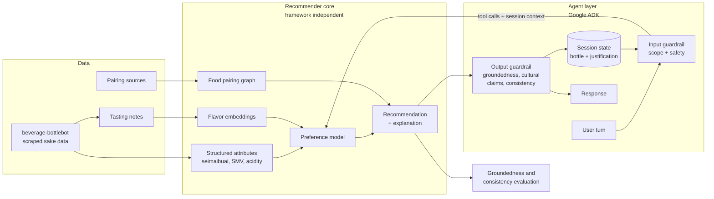

# sake-sommelier

A recommendation and explanation system for sake, built around a harder question than "what should I drink next."

**Status:** architecture settled, implementation starting. Data collection is complete. The recommender core is next; the agent layer follows it. Sections below are marked as either *built* or *planned* so it is clear what exists today.

---

## The problem

Most beverage recommenders answer the wrong question. They match a bottle to a bottle: you liked this junmai daiginjo, here are five more junmai daiginjos. That works until it doesn't, and it never tells you anything about yourself.

The interesting question is *why* a person likes what they like. Someone who gravitates toward a particular brewery's output may be responding to rice polishing ratio, to a yeast strain's ester profile, to acidity, to serving temperature, or to the fact that they first drank it with grilled eel. Those are different preferences that produce identical purchase histories, and they generalize in completely different directions.

This project treats preference as something to be inferred and explained rather than pattern-matched. The output is not a bottle. It is a bottle, a defensible reason, and something to eat with it — expressed in terms of attributes the drinker can recognize and use.

The long-term vision is a conversational avatar that acts as a personal sommelier: it learns your palate through interaction, grounds every recommendation in structured knowledge, and can say why.

## Why this is technically interesting

Four problems stack here, and each is a real one:

**Preference inference from sparse signals.** A user might rate a dozen bottles. Latent taste dimensions have to be inferred from very little, which makes this a cold-start problem before it is a recommendation problem.

**Encoding expert knowledge.** Food pairing logic lives mostly in the heads of sommeliers and in prose that was written for human readers. Turning that into something a model can traverse and reason over is a knowledge representation problem, not a scraping problem.

**Grounded explanation across a chain.** It is easy to have a language model produce a plausible-sounding reason. It is hard to produce a reason that is actually entailed by the underlying data, and harder still when the second recommendation has to stay consistent with the first. This is the part the evaluation design cares most about.

**Bounded agency.** An agent that can talk about anything is a worse product than one that can talk about one thing well. Constraining scope, refusing gracefully, and staying inside a domain under adversarial input is a design problem, not a prompt.

## Data

*Built.* Source data comes from [beverage-bottlebot](https://github.com/swidvey/beverage-bottlebot), a companion project that scrapes and structures sake information: brewery, classification, rice variety, polishing ratio (seimaibuai), sake meter value, acidity, alcohol content, and tasting notes where available.

That repository handles collection and normalization. This one consumes its output and does the modeling.

## Approach

**Layer 1: structured attributes.** *Planned.* The scraped fields form the tabular backbone. Classification, seimaibuai, SMV, and acidity are the objective dimensions and they carry real signal on their own.

**Layer 2: flavor embeddings.** *Planned.* Tasting notes are unstructured prose. Embedding them places bottles in a continuous flavor space where similarity is not constrained by classification labels, which is the point: two bottles from different categories can taste more alike than two from the same one.

**Layer 3: pairing knowledge.** *Planned.* Food pairing relationships modeled as a graph rather than a lookup table, so the system can reason across edges (a pairing works because of a shared umami characteristic) instead of only retrieving stored pairs.

**Layer 4: conversation and explanation.** *Planned.* An agent interface built on [Google ADK](https://adk.dev/) that elicits preference through dialogue and produces recommendations grounded in layers 1 through 3, with every claim traceable to an attribute or a graph relationship.

Layers 1 through 3 are deliberately framework-free. The recommender core is a set of typed, callable tools with no dependency on the agent framework, so the agent layer sits on top of it rather than inside it. Swapping ADK for something else should be an afternoon, not a rewrite.

## The chained recommendation

*Planned.* The system does not answer two independent questions. It answers one and then builds on it.

The sake recommendation comes first, inferred from palate. The food pairing is then derived **from that bottle**, not from a dish the user supplied. So the pairing query is conditioned on an entity that exists only in conversation state, and that has consequences beyond bookkeeping.

**State carries the justification, not just the bottle.** If a sake was recommended for its high acidity and melon esters, the pairing rationale has to build on those same attributes. Persisting only a bottle ID throws away the reasoning and lets the third turn quietly contradict the first.

**Groundedness becomes a multi-turn property.** A pairing explanation that appeals to an attribute the sake explanation never established is a new ungrounded claim, even when the pairing edge genuinely exists in the graph. Explanations are therefore scored as conversation-level chains, not as isolated responses.

**Consistency is a distinct failure mode.** A claim can be individually traceable to the data and still contradict what the agent asserted two turns earlier. That is its own defect and it gets its own metric.

## Session state and memory

*Planned.* Three things get conflated under "memory" and this project needs them separated:

**Session state** holds the current conversation: the recommended bottle, the justification behind it, elicited preferences, and stated constraints. This is what the chained recommendation actually depends on, and it is required for the demo.

**Cross-session memory** is the palate learned across visits — what "learns your palate over time" means in the vision statement. It is deferred, because it presupposes persistent users this project does not yet have.

**The retrieval corpus** is bottle data, not memory, and is kept architecturally distinct from both.

Implementation uses ADK's `DatabaseSessionService`, which is SQLAlchemy-backed and so runs against SQLite locally and AlloyDB in GCP without a code change — the same local-first constraint that governs the rest of the stack. AlloyDB is also capable of vector search, so the session store and the flavor embedding index may collapse into a single component rather than two; that decision waits on the data volume. Vertex AI Agent Engine Memory Bank is the intended path for cross-session palate memory when it is built, with the tradeoff that it has no local equivalent and would break the laptop-only path if adopted for session state.

## The avatar

*Planned.* The avatar is defined by expertise, not by nationality. It is a sommelier, not a Japanese person. There is no ethnic persona, no assumed accent, and no costume — the credibility comes from being right about the subject.

That decision is not only an ethical one, it is also what makes cultural sensitivity testable. Nearly every way a language model is culturally careless about sake shows up as a **fabricated cultural claim**: invented brewery lineage, a regional tradition that does not exist, confident mystique about ritual. That is the same failure mode as an ungrounded tasting claim, so it is scored by the same evaluation. Cultural claims are factual claims and are held to the same standard of traceability.

Concrete rules the system prompt encodes and the evaluation checks:

- Sake is brewed. The parallel is beer, not wine, and it is never called "rice wine." In Japan *sake* (酒) means alcohol generally; the drink is *nihonshu*.
- Romanization is consistent (Hepburn) across junmai, ginjo, daiginjo, seimaibuai, nihonshu-do, kimoto, yamahai, namazake.
- Terminology is explained, not exoticized. No ancient secrets, no ritual mystique, no invented ceremony.
- Regional and brewery context is cited or omitted. Not improvised.

Terminology and framing are intended for review by a certified sake professional before the interface ships.

## Guardrails

*Planned.* Layered, weakest control last:

**Capability limitation.** The strongest guardrail is architectural. The agent's tools are `retrieve_bottle`, `query_attributes`, `traverse_pairing_graph`, and `explain`. There is no code interpreter and no general web search, so the agent is not equipped to do a stranger's homework regardless of how the request is phrased.

**Input classification.** A cheap fast model in a `before_model_callback` buckets each turn as in-scope, borderline, or out-of-scope before the main model sees it. Out-of-scope turns get a redirect and never reach the recommender.

The scope boundary keys on **task shape, not topic**. "What is seimaibuai" is teaching, which is the product. "Write my essay on Meiji-era brewing" is an academic artifact, which is not. A sommelier that refuses to explain things is a bad sommelier, so the classifier is tuned to be permissive about questions and strict about deliverables.

**Domain safety.** This is an alcohol product, and the real liability surface is not homework:

- Age attestation gate before any recommendation.
- Vulnerable-context handling. Pregnancy, medication interactions, and recovery get a kind redirect, not a pairing.
- No health claims. No encouragement of volume.
- No invented prices, vintages, or availability.

**Injection resistance.** Tasting notes are scraped third-party prose flowing into model context. Retrieved text is treated as data, never as instruction.

**Output verification.** Responses pass a groundedness and consistency check before delivery, covering attribute claims, cultural claims, and agreement with what earlier turns already asserted.

## Evaluation

*Planned.* A recommender that cannot be scored is a demo. The intended evaluation has five parts:

**Recommendation quality.** Held-out ranking on preference data: given a set of liked bottles, does the true held-out favorite rank highly against distractors.

**Pairing correctness.** A labeled set of food and sake pairings drawn from published sommelier sources, used as ground truth to score the system's suggestions.

**Explanation groundedness.** The measure that matters most. For each generated explanation, is every factual claim traceable to a specific attribute or graph relationship in the underlying data. Scored with an automated judge, anchored to a hand-labeled subset so that judge drift is detectable. An explanation that sounds right but is not entailed by the data counts as a failure, not partial credit. Cultural and historical claims are scored under this same rubric.

**Conversational consistency.** Scored over whole sessions rather than single responses. Does the pairing rationale rest on attributes the sake rationale actually established, and does any later turn contradict an earlier one. Traceable-but-inconsistent is a failure.

**Guardrail performance.** A red-team set of out-of-scope requests, scope-boundary edge cases, injection attempts embedded in tasting-note text, and vulnerable-context prompts. Measured as refusal accuracy in both directions, because over-refusal is also a defect.

## Architecture

## Stack

The dataset is small, and the infrastructure choices reflect that rather than reaching for managed services the data volume does not justify. The same code runs locally and on GCP; the difference is configuration, not architecture.

| Concern | Implementation | Notes |
| --- | --- | --- |
| Attributes | DuckDB | In-process. A few thousand bottles does not need a managed database. |
| Vectors | Embedded store, or AlloyDB vector search | Consolidating with the session store is on the table. Vertex AI Vector Search is overkill at this scale. |
| Pairing graph | In-process graph | A managed graph database is not warranted by the traversal complexity. |
| Session state | ADK `DatabaseSessionService` | SQLite locally, AlloyDB in GCP. Same code either way. |
| Cross-session memory | Vertex AI Agent Engine Memory Bank | Deferred. Presupposes persistent users. |
| Agent | Google ADK | Callbacks for guardrails, built-in eval harness, Cloud Run deployment path. |
| Model | Routed through the ADK model abstraction | So the stack runs without a GCP key. |
| Runtime | Docker, Cloud Run | Scale to zero. |
| Infrastructure | Terraform | Committed, so the deployed architecture is legible whether or not it is running. |

## Running it

*Planned.* Local first. `docker compose up` should bring the whole stack up on a laptop with no cloud account, which is also what makes the deployed version a configuration change rather than a separate codebase.

The GCP deployment is stood up for demonstration and torn down afterward. Running a Gemini-backed public endpoint continuously is not a sensible cost for a project with no users, so the live deployment is deliberately ephemeral and the Terraform in this repository is the durable record of it. A recorded walkthrough of the running application stands in for a permanent URL.

**Demo video:** *link pending.*

## Roadmap

1. Ingest and normalize bottlebot output into a working dataset, with a documented row count and field coverage report
2. Baseline recommender on structured attributes only, with a ranking metric to beat
3. Flavor embeddings from tasting notes, measured against that baseline
4. Pairing graph and the labeled pairing evaluation set
5. Explanation layer with groundedness scoring
6. Guardrail suite and its red-team evaluation set
7. Conversational agent on ADK
8. Session state and the chained sake-to-pairing flow, with consistency evaluation
9. Containerization, Terraform, and deployment
10. Cross-session palate memory
11. Avatar interface

Steps 1 through 3 are the near-term scope. Everything after step 9 is vision, not commitment.

## Limitations and open questions

The dataset is not large, and preference data is the binding constraint rather than bottle metadata. Tasting notes are written by different people with different vocabularies and no shared rubric, which makes the embedding space noisier than it looks. Published pairing guidance is frequently contradictory, so "ground truth" for pairings is really consensus among sources rather than fact.

The sharpest open problem is where preference data comes from at all. With no user base, there is no ratings history to learn from, which pushes the design toward eliciting preference entirely within a session — cold start by dialogue, with no historical signal. That is a more interesting problem than collaborative filtering, but it changes what the ranking metric in step 2 can be evaluated against, and that has to be settled before the baseline is built rather than after.

Chaining the pairing off the recommendation also compounds error. A mediocre bottle recommendation produces a pairing that is reasonable given the bottle and useless given the palate, and the second failure is harder to see than the first. Whether the two stages should be scored jointly or separately is unresolved.

The honest second question is whether explanation groundedness can be scored well enough to serve as a training signal, or whether it only works as an evaluation gate.

## Related work

- [beverage-bottlebot](https://github.com/swidvey/beverage-bottlebot) — data collection and normalization for sake information

## License

MIT
